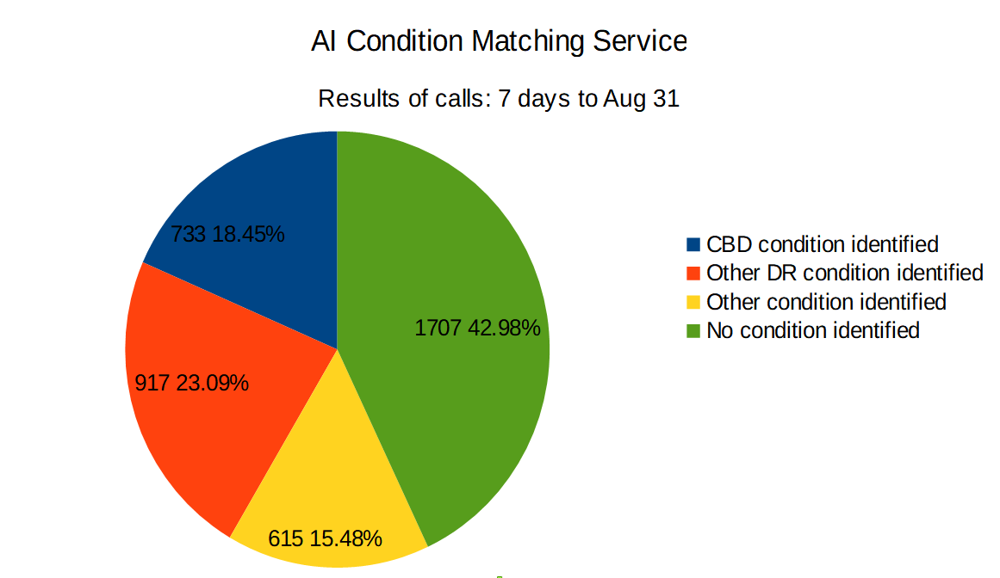

#############################
AI-assisted Condition Mapping
#############################

This service helps maximise the number of times MyService can automatically
match the veteran's particular condition to one on the list of *SoP* conditions for which DVA provides treatment and compensation.  It uses machine-learning techniques to match the veteran's description of their diagnosis to a SoP condition - as well as conventional text-matching and spell-checking.  The AI component exploits a Microsoft cloud-based commercial natural language processing API: *Language Understanding Intelligence Service* DVA staff claims assessors contributed expert guidance to its initial training. 

The department has historically taken an entirely manual approach to classifying a condition: veterans write their medical condition in free form text on a form. This was either on a paper claim form or an online form called the *Single Online Claim Form*, or more-recently a drop-down box in MyService.

Claims assessment officers then attempt to match the veteran's description to a recognised SoP condition, following policy guidance (Policy Guidance Note AN08, Full Federal Court Decision	- Benjamin v The Repatriation Commission). This can involve time-consuming and frustrating correspondence with the applicant to clarify their condition: their description or their doctor's description rarely matches one of the white-listed SoP conditions closely.  The automatic approach removes this pain in a substantial portion of cases.

Additionally, it makes the most of Decision Ready Processing: it enables MyService to route more claims down the fast-tracked path automatically. Otherwise, these claims would miss out on the fast-tracked processing.

Before using this function, MyService automatically classified only 10.5% of claims into one of the fast-tracked categories: Straight-Through, Streamlined or Computer-Based Decisions. (Source: production logs for MyService from late December 2017 to end of June 2018 showed 6421 claims, of which only 671 were tagged for fast-tracked processing.)

    Classification of conditions, derived from AI condition matcher logs from week commencing 20 August 2018.  Note that *calls* refers to API service calls - a proxy for claim proportions, but not absolute numbers.

In light of data collected from production, Gov Law Tech and DVA further tuned the AI.  These changes took effect on 1 December 2018.  This increased its effectiveness by 10 to 15% so MyService correctly fast-tracks around half of initial liability claims.

How does the Mapper Work?
*************************

The input of the Mapper is the medical condition as described by the user.  For example, the user may describe their condition as a 'snake bite'.  The output is a list of current SoP conditions, each with a number from 0 - 100.  The number indicates how confident the service is that the condition as described by the user matches the SoP condition.  For example, for 'snake bite', the service might say it matches the SoP 'animal envenomation' with confidence '97' and 'alcohol use disorder' with confidence level '7'.  MyService then makes a decision about how to treat the condition based on a configured confidence threshold.  For example, if MyService is configured to assume that matches with a confidence of 97 or higher are correct.  In that that case, it would treat the claim as an initial liability claim for 'animal envenomation'.  It can then present appropriate SoP factors to the user.

What is some more detail on how the mapping process works?
==========================================================

The Mapper follows the following steps:

#. First, the Mapper checks if the condition is a case-insensitive match for a condition name in a current Statement of Principle.  The condition names are exactly as in the written in the SoP, except that they are case insensitive.  For example, 'snake bite' is not a recognised condition.  The likely condition is 'animal envenomation'.  This is the exact name of the condition from the relevant SoP.  If the user entered 'Animal Envenomation', this would match however -- even though it uses capital letters and the SoP uses lower case letters.
#. If there is an exact match, the Mapper sends back the name of the condition to MyService with a confidence level of '100'.  There is no need to attempt any fuzzy matching.
#. Otherwise, the Mapper attempts to match using fuzzy matching.  The current fuzzy matching approach uses a configured instance of Microsoft's Language Understanding Intelligence Service.  DVA staff trained and configured this service with common ways conditions are described.  This step results in a list of conditions from the configuration and corresponding confidence levels.
#. Finally, the Mapper checks that the output from the fuzzy matching service still matches a current SoP condition.  This is important because the names of SoP conditions can change: usually when the RMA splits or merges existing SoPs.  This step is so that the service does not recommend obsolete conditions before DVA has a chance to retrain it for the new conditions.

How does the fuzzy matching process work?
=========================================

The fuzzy matching process currently relies on a Microsoft service called Language Understanding Intelligence service.  The internals of this service are not visible - it's proprietary.  According to Microsoft, it uses "state-of-the-art language models that understand the utterance's meaning and capture word variations, synonyms, and misspellings".  It likely relies mainly on a technology called 'word embedding'.  Essentially, the service recognises how much of a particular 'topic' a word or group of words contains -- based on training across a large corpus of text.  For example, the word 'snake' may contain some of a topic relating to animals, and some of a topic relating to poison. It finds the mix of the topics in the words with DVA has configured for a medical condition.  It then checks how similar the topics of the user's description of their condition are to those topics.  